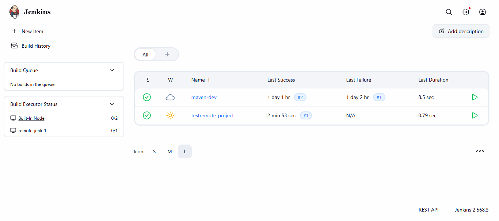
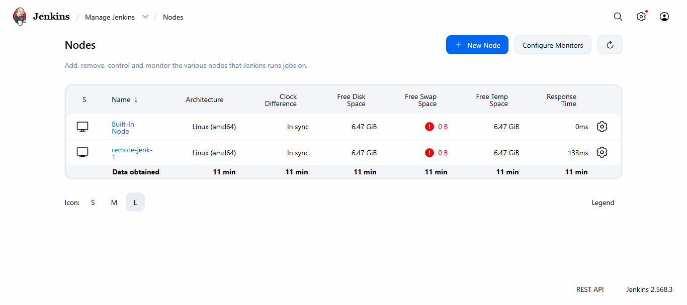
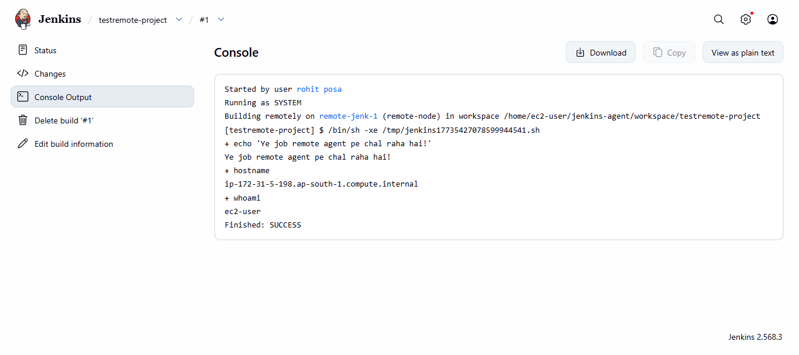

# CodeAlpha Jenkins Remoting Project

## Overview
Set up a Jenkins Controller and Remote Agent on an AWS EC2 instance (t2.medium, redhat server). Configured a permanent agent node connected via JNLP over WebSocket, and ran a test job restricted to execute specifically on the remote agent.

## Screenshots

### Jenkins Dashboard

### Nodes Overview Page

### Console Output - Job Successfully Ran on Remote Agent

## Result
The job successfully executed on the "remote-jenk-1" node (Build: SUCCESS), confirming that the Jenkins Controller-Agent architecture was correctly set up and configured.
